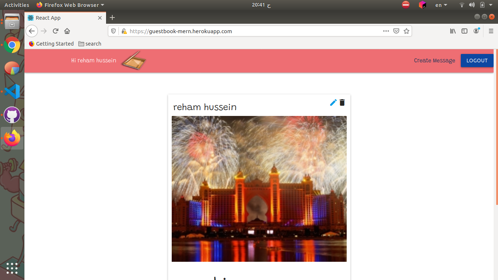

# guestbook_MERN
Guest BookApp using MongoDB Express ReactJS NodeJS

## Installation
get all dependencies

```bash
npm install
cd client 
npm install
```

## Feature
- user can create new account & login using it
- can create, delete & update message 
- message content is title, body & photo
- user can make a comment or delete
- every user can only delete his own message or comment 


## Demo

### Hosting URL
https://guestbook-mern.herokuapp.com/signin

### Screenshots





